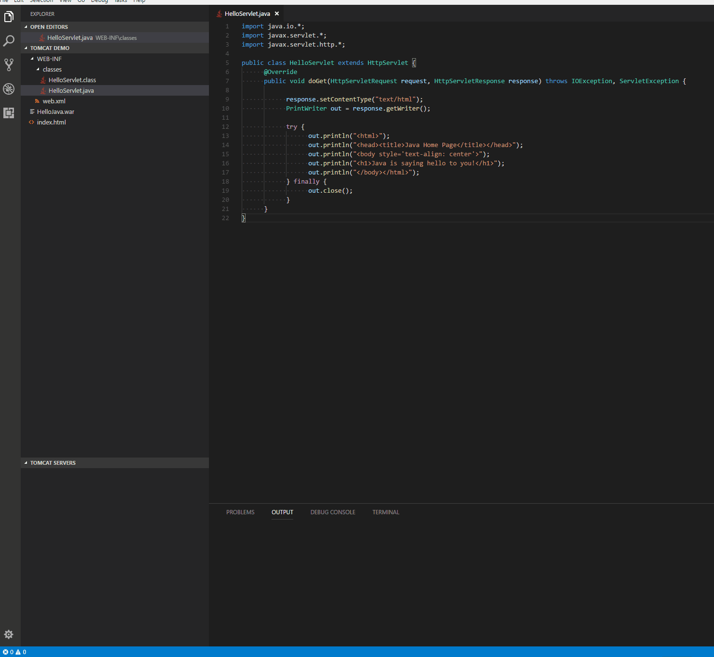

# Wildfly for Visual Studio Code

## Usage



## Features
* Add Wildfly Server from Wildfly Install Path
* Start/Restart Wildfly Server from VSCode
* Run war package on Wildfly Server
* Debug war package on Wildfly Server
* Run exploded war on Wildfly Server
* Debug exploded war on Wildfly Server
* Open server homepage in browser to check all deployed war packages
* View all deployed war packages in Wildfly Explorer
* Open war package homepage in browser
* Stop Wildfly Server
* Rename Wildfly Server
* Customize JVM Options when starting Wildfly Server
* Reveal deployed war packages in file explorer
* Delete deployed war package

## Prerequisites
* [Wildfly](https://www.wildfly.org/)
* [Debugger for Java](https://marketplace.visualstudio.com/items?itemName=vscjava.vscode-java-debug) (for debuging war package)

## Install
1º ```rm -rf node_modues package-lock.json```
2º ```npm install```

## Release Notes
Refer to [CHANGELOG](CHANGELOG.md)

## Telemetry
VS Code collects usage data and sends it to Microsoft to help improve our products and services. Read our [privacy statement](https://go.microsoft.com/fwlink/?LinkID=528096&clcid=0x409) to learn more. If you don't wish to send usage data to Microsoft, you can set the `telemetry.enableTelemetry` setting to `false`. Learn more in our [FAQ](https://code.visualstudio.com/docs/supporting/faq#_how-to-disable-telemetry-reporting).